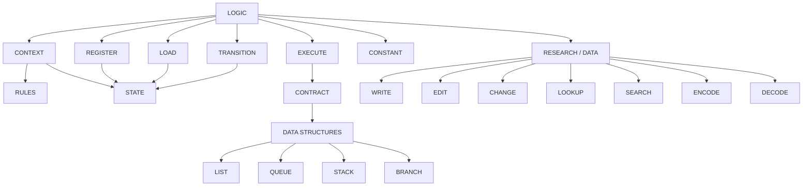

<div align="center"> <pre> 
 ██████╗██╗  ██╗ █████╗  ██████╗ ███████╗
██╔════╝██║  ██║██╔══██╗██╔═══██╗██╔════╝
██║     ███████║███████║██║   ██║███████╗
██║     ██╔══██║██╔══██║██║   ██║╚════██║
╚██████╗██║  ██║██║  ██║╚██████╔╝███████║
 ╚═════╝╚═╝  ╚═╝╚═╝  ╚═╝ ╚═════╝ ╚══════╝
</pre>

[](https://git.io/typing-svg)

</div>

<div align="center">


</div>

---

# Chaos

Chaos is a programming language designed around computational structures rather than conventional programming-language syntax.

It began from a simple frustration: having to memorize different syntax and programming conventions for every language and tool used in software development. Chaos explores whether programming can instead be expressed through a smaller set of clear, composable concepts.

The goal is not to make programming "easier" by hiding computation. It is to make the structure of computation easier to express.

Chaos is currently in active development and is being implemented in C as a way to explore the foundations of programming languages, parsers, runtimes, state, and computation.

## Version 1

Chaos v1 is a functional programming language built around a small set of computational primitives.

The central idea is that computation in Chaos should be expressed through processes, states, rules, reusable operations, and transformations rather than through a large collection of specialized syntax.

The core primitives are:

* `logic` — defines a process or unit of active computation
* `execute` — runs an executable operation from within `logic`
* `contract` — defines a reusable operation with a known purpose and rules
* `register` — holds the currently active computational states available to `logic`
* `state` — represents information or a condition that can be stored, loaded, changed, and reused
* `load` — retrieves a state from the register or context into the current logic
* `transition` — changes one state into another according to defined rules
* `constant` — stores a local value that remains available to a piece of `logic`
* `context` — defines the environment in which a piece of logic operates
* `rules` — defines constraints or conditions governing what may happen within a context

Chaos also provides general-purpose data structures:

* `list` — ordered collection of data
* `queue` — first-in, first-out collection
* `stack` — last-in, first-out collection
* `branch` — hierarchical tree-like data structure

These structures can be manipulated through operations such as:

* `push` — adds data to a storage structure
* `pop` — retrieves and removes data from a storage structure

Research and information-oriented operations are also part of the language model:

* `write` — creates a textual research record, note, document, or other material
* `edit` — modifies existing textual material
* `change` — modifies structured research data at its source and may trigger dependent recalculation
* `lookup` — retrieves existing information from the Chaos project
* `search` — searches external sources for research material
* `encode` — converts Chaos data into an external representation such as a chart, table, diagram, Markdown, Mermaid, or eventually a paper/PDF
* `decode` — extracts structured information from an encoded representation or converts one representation into another useful form

The core syntax is intentionally small. Much of Chaos's practical functionality is intended to come from libraries of contracts and reusable computational structures rather than from continually adding new language primitives.

## Architecture

The conceptual structure of Chaos is currently centered around `logic`, state, contracts, and execution.



The implementation is deliberately being developed from the bottom up. The current goal is not to implement the entire conceptual architecture at once, but to establish a working parser and runtime and then build the language around them.

## Beyond Version 1

Chaos is intended to grow beyond a programming language into a broader computational environment.

Version 2 will introduce the Chaos CLI.

Later versions may introduce separate computational domains rather than forcing every capability into the core language.

Potential domains include:

* mathematics
* physics
* scientific computing
* astrophysics
* quantum computation
* hardware-oriented programming
* scientific visualization

These domains are intended to build upon Chaos Core while remaining conceptually separate from it. A developer writing an ordinary application should not need to carry an entire mathematical or physics system into the core language.

The long-term ambition is considerably larger:

```text
Chaos
  ↓
programming language
  ↓
computational environment
  ↓
Chaos applications
  ↓
Chaos ecosystem
  ↓
Chaos-centric operating environment
```

That is a long way off.

For now, the objective is considerably less glamorous:

**Make Chaos v1 work.**

## Why Chaos Exists

Chaos started because I got tired of memorizing different syntax for every programming language I had to use.

As a software developer, I found myself spending an unreasonable amount of time remembering whether some particular thing required a certain keyword, punctuation mark, syntax pattern, library call, framework convention, or entirely different language.

At some point I decided that, instead of complaining about it, I could try designing the language I actually wanted to use.

The result is Chaos.

It is an experiment in whether programming can be expressed through computational concepts rather than through the accumulated historical baggage of programming-language syntax.

I am also making this while learning how languages, compilers, runtimes, and computer systems actually work, so some of the architecture will undoubtedly evolve as the implementation catches up with the ideas.

That is part of the project.

---

<div align="center">
<sub>Chaos is a work in progress. Star the repo to follow along.</sub>
</div>