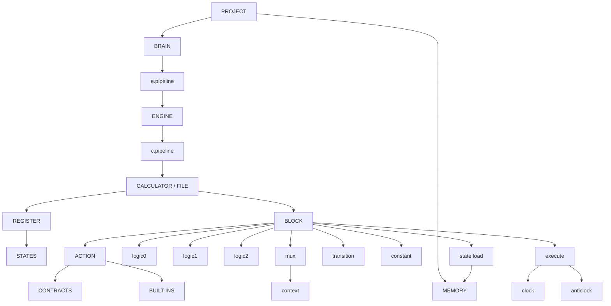

<div align="center"> <pre> 
 ██████╗██╗  ██╗ █████╗  ██████╗ ███████╗
██╔════╝██║  ██║██╔══██╗██╔═══██╗██╔════╝
██║     ███████║███████║██║   ██║███████╗
██║     ██╔══██║██╔══██║██║   ██║╚════██║
╚██████╗██║  ██║██║  ██║╚██████╔╝███████║
 ╚═════╝╚═╝  ╚═╝╚═╝  ╚═╝ ╚═════╝ ╚══════╝
</pre>

[](https://git.io/typing-svg)

</div>

<div align="center">


</div>

---

# Chaos

Chaos is a programming language designed around computational structures rather than conventional programming-language syntax.

It began from a simple frustration: having to memorize different syntax and programming conventions for every language and tool used in software development. Chaos explores whether programming can instead be expressed through a smaller set of clear, composable concepts.

The goal is not to make programming "easier" by hiding computation. It is to make the structure of computation easier to express.

## Version 1

Chaos v1 is a functional programming language. Its core model is built around calculators, registers, states, blocks, actions, logic, transitions, memory, and reusable contracts.

A Chaos project contains:

* one **brain**, the project's central computational component
* one **memory**, the project's central data storage
* multiple **calculators**, which are individual Chaos files
* registers containing the active states of each calculator
* blocks containing the operations that make up a program

The core logic primitives are:

* `logic0` — primitive conditional logic
* `logic1` — repetition and loops
* `logic2` — temporary retention and cache
* `mux` — contextual state switching
* `context` — contextual information used by `mux`

Blocks are built primarily from:

* `action` — operations composed from contracts and built-ins
* `contract` — predefined reusable functions or instructions
* `built-in` — larger language-provided operations
* `transition` — rules governing state changes
* `constant` — block-specific fixed data
* `state load` — retrieval of project data from memory
* `execute` — execution of a block
* `clock` — execution following the normal flow
* `anticlock` — execution independently of the normal flow

Calculators can be connected into engines using `c.pipeline`, while engines connect to the project's central brain through `e.pipeline`.

The language also provides common data structures such as lists, linked lists, stacks, queues, trees, and branches.

The core syntax is intentionally small. Much of Chaos's practical functionality comes from its libraries of contracts, transitions, contexts, and built-ins rather than from an ever-growing collection of primitive language instructions.

## Architecture



## Beyond Version 1

Chaos is intended to grow as a computational environment rather than remain only a programming language.

Version 2 will introduce the Chaos CLI.

Later versions will introduce separate computational domains rather than forcing every capability into the core language.

The first major expansion is mathematics.

The mathematical layer will introduce named mathematical functions through `encode` and `decode`, while `sequence` will provide a place for mathematical processes that do not naturally belong within those functions.

Future domains may include:

* mathematics
* physics
* scientific computing
* astrophysics
* quantum computation
* hardware-oriented programming
* scientific visualization

The intention is for these domains to build upon Chaos Core while remaining conceptually separate from it. A developer writing an ordinary application should not need to carry an entire mathematical or physics language around with them.

The long-term ambition is considerably larger:

```text
Chaos
  ↓
programming language
  ↓
computational environment
  ↓
Chaos applications
  ↓
Chaos ecosystem
  ↓
Chaos-centric operating environment
```

That is a long way off. For now, the objective is considerably less glamorous:

**Make Chaos v1 work.**

## Why Chaos Exists

Chaos started because I got tired of memorizing different syntax for every programming language I had to use.

As a software developer, I found myself spending an unreasonable amount of time remembering whether some particular thing required a certain keyword, punctuation mark, syntax pattern, library call, framework convention, or entirely different language.

At some point I decided that, instead of complaining about it, I could try designing the language I actually wanted to use.

The result is Chaos.

It is an experiment in whether programming can be expressed through computational concepts rather than through the accumulated historical baggage of programming-language syntax.

I am also making this while learning how languages, compilers, runtimes, and computer systems actually work, so some of the architecture will undoubtedly evolve as the implementation catches up with the ideas.

That is part of the project.

## Current Implementation

Chaos itself is being implemented in **C**.

The CLI is planned to be implemented separately in **Rust** for Version 2.

The current priority is the Chaos language itself. The first milestone is a working implementation capable of parsing and executing real Chaos programs.

The larger ambitions can wait.

One programming language at a time.

---

<div align="center">
<sub>Chaos is a work in progress. Star the repo to follow along.</sub>
</div>