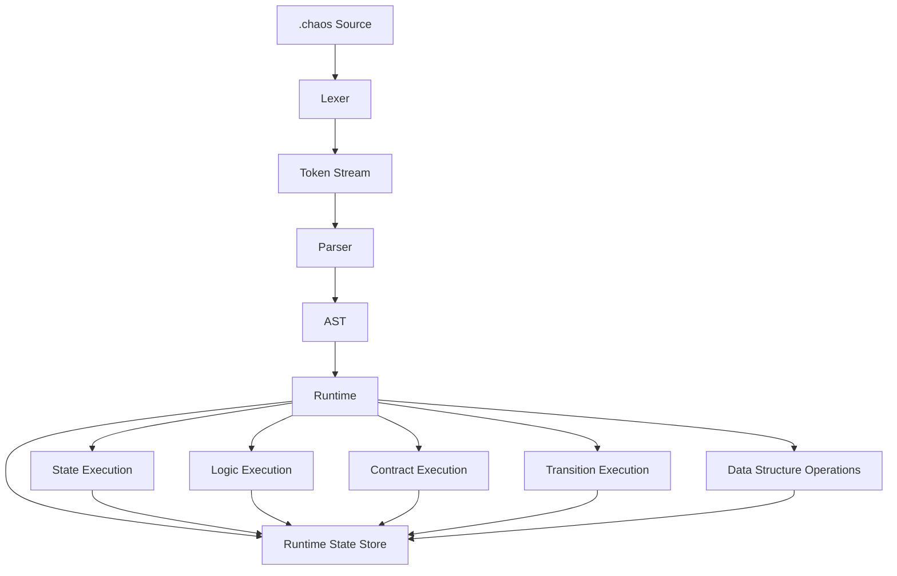

# Chaos Architecture

Chaos is implemented as a compiled language pipeline in C. A Chaos program moves through several distinct stages before execution:

```text
                    ┌─────────────────┐
                    │  .chaos Source  │
                    └────────┬────────┘
                             │
                             ▼
                    ┌─────────────────┐
                    │      Lexer      │
                    └────────┬────────┘
                             │
                        Token Stream
                             │
                             ▼
                    ┌─────────────────┐
                    │     Parser      │
                    └────────┬────────┘
                             │
                             ▼
                    ┌─────────────────┐
                    │       AST       │
                    └────────┬────────┘
                             │
                             ▼
                    ┌─────────────────┐
                    │     Runtime     │
                    └────────┬────────┘
                             │
                             ▼
                  ┌──────────────────────┐
                  │ Runtime State Store  │
                  └──────────────────────┘
```

## 1. Source

Chaos programs use the `.chaos` file extension.

A program consists of declarations and executable constructs such as registers, states, logic, contexts, rules, transitions, contracts, and data-structure operations.

A simple program may look like:

```chaos
register main
    state: x = 10,
    state: name = 'Zia',
```

The source is intentionally structured around named computational concepts rather than traditional statement-oriented syntax.

## 2. Lexer

The lexer converts raw source text into a sequence of tokens.

The lexer recognizes:

* Keywords
* Identifiers
* Numbers
* Strings
* Expressions
* Operators
* Punctuation
* Data-structure declarations
* Execution constructs

Expressions are represented using `{}`:

```chaos
state: result = {x + 10},
```

Strings use single quotes:

```chaos
state: name = 'Zia',
```

Expressions are tokenized as complete expression regions, with nested braces tracked by the lexer.

For example:

```chaos
{x + {y * 2}}
```

is treated as a single expression token.

## 3. Parser

The parser consumes the token stream and constructs an Abstract Syntax Tree.

The parser is responsible for understanding the grammatical structure of Chaos programs.

Conceptually:

```text
Tokens
  │
  ├── REGISTER
  │     ├── STATE
  │     ├── STATE
  │     └── ...
  │
  ├── LOGIC
  │     ├── RULE
  │     └── EXECUTE
  │
  └── TRANSITION
```

The resulting AST preserves the structure required by the runtime rather than simply reproducing the source text.

## 4. Abstract Syntax Tree

The AST provides an explicit representation of Chaos constructs.

Major node categories include:

```text
PROGRAM
│
├── REGISTER
│   └── STATE DECLARATION
│
├── LOGIC
│   ├── EXPRESSION
│   ├── IF
│   ├── ELSE IF
│   └── ELSE
│
├── CONSTANT
├── CONTRACT CALL
├── EXECUTE
├── TRANSITION
├── CONTEXT
│   └── RULE
│
└── DATA STRUCTURE OPERATION
    ├── LIST
    ├── QUEUE
    ├── STACK
    └── BRANCH
```

The AST also explicitly records data types. This prevents the runtime from having to infer the intended structure from arbitrary strings.

## 5. Runtime

The runtime walks the AST and performs the operations represented by its nodes.

```text
                 AST
                  │
                  ▼
          ┌───────────────┐
          │ Runtime       │
          │ Dispatcher    │
          └───────┬───────┘
                  │
       ┌──────────┼──────────┐
       ▼          ▼          ▼
    States      Logic     Operations
       │          │          │
       └──────────┼──────────┘
                  ▼
          Runtime State Store
```

The runtime is responsible for:

* Creating runtime states
* Resolving state names
* Executing logic
* Evaluating conditions
* Executing contracts
* Performing transitions
* Managing data structures
* Executing `push` and `pop`
* Handling runtime errors
* Maintaining the current execution state

## 6. Runtime State Store

The Runtime State Store maintains the live state of a Chaos program.

A runtime state contains:

```text
┌─────────────────────────┐
│ Runtime State            │
├─────────────────────────┤
│ name                    │
│ value                   │
│ next                    │
└─────────────────────────┘
```

Runtime values may represent:

```text
NUMBER
STRING
EXPRESSION
LIST
QUEUE
STACK
BRANCH
```

The AST's declared type and the runtime value's actual type are validated before operations are performed.

```text
AST declaration
      │
      ▼
  declared type
      │
      │ validation
      ▼
Runtime State
      │
      ▼
actual runtime value
```

A mismatch produces a runtime error rather than allowing an invalid operation to proceed.

## 7. Execution Model

Chaos separates program description from runtime state.

```text
                  SOURCE
                    │
                    ▼
                   AST
                    │
                    ▼
                EXECUTION
                    │
          ┌─────────┴─────────┐
          ▼                   ▼
      Operations           State
          │                   │
          └─────────┬─────────┘
                    ▼
             Runtime State
```

The AST describes what the program contains.

The Runtime State Store describes what the program currently contains.

This distinction allows the same AST structure to be executed while runtime values change.

## 8. Component Relationship

The overall architecture can be represented as:



The separation between lexer, parser, AST, and runtime keeps the language implementation modular and allows each layer to evolve independently.