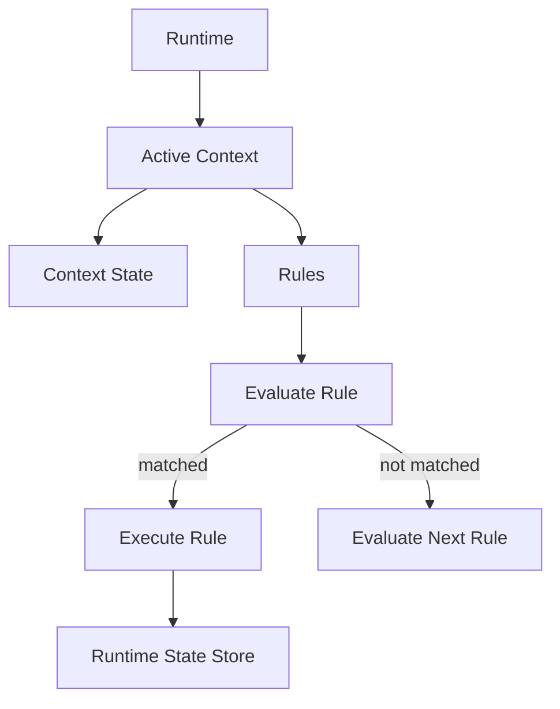

# Chaos Contexts and Rules

Contexts provide a way to organize computation around a particular execution environment.

Rules define behavior that should occur when their associated conditions are satisfied.

## 1. Context

A context represents a named computational environment.

Conceptually:

```text
CONTEXT
│
├── STATE
├── RULE
├── RULE
├── ...
└── EXECUTION
```

A context can therefore group related state and behavior without requiring every operation to exist in the global execution environment.

## 2. Contextual Execution

The runtime maintains the active context while executing contextual logic.



## 3. Rules

A rule associates a condition with executable behavior.

Conceptually:

```text
RULE
│
├── CONDITION
│
└── ACTION
```

For example:

```text
rule
    condition → execute operation
```

When the rule is evaluated, its condition is checked against the current runtime state.

## 4. Rule Evaluation

Rules are evaluated using the same runtime state available to other execution constructs.

```text
Runtime State
      │
      ▼
Rule Condition
      │
 ┌────┴────┐
 ▼         ▼
true      false
 │         │
 ▼         ▼
execute   continue
```

A rule that does not match does not modify runtime state.

## 5. Multiple Rules

A context may contain multiple rules.

```text
context
│
├── rule A
├── rule B
├── rule C
└── rule D
```

The runtime evaluates the rules according to their defined execution order.

This provides a structured mechanism for expressing state-dependent behavior.

## 6. Context and Transition

Contexts can participate in transitions.

```text
Context A
    │
    │ transition
    ▼
Context B
```

This allows a program to model changing computational situations.

## 7. Contextual State

Context-specific state remains part of the runtime state system.

The context determines which behavior is active, while the Runtime State Store maintains the actual values.

```text
              Runtime
                 │
          ┌──────┴──────┐
          ▼             ▼
       Context       State Store
          │             │
          ▼             ▼
        Rules         Values
```

## 8. Rules and Logic

Rules use the same expression and conditional mechanisms as ordinary logic.

This means a rule can evaluate:

* Numeric comparisons
* State values
* Expressions
* Boolean conditions
* Context-dependent state

The distinction is primarily organizational: logic describes computation, while rules associate computation with contextual conditions.