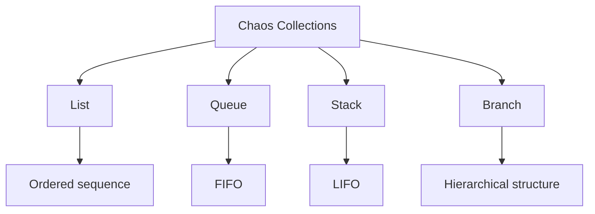

# Chaos Data Structures

Chaos provides four fundamental collection types:

```text
LIST
QUEUE
STACK
BRANCH
```

Each collection has explicit runtime semantics.

## 1. Collection Overview



## 2. Lists

A list is an ordered collection.

```chaos
state: fruits, list = {
    'apple',
    'banana',
    'blueberry'
},
```

Its elements maintain their insertion order.

```text
[index]
   0        1         2
┌───────┬────────┬───────────┐
│ apple │ banana │ blueberry │
└───────┴────────┴───────────┘
```

### Push

`push` appends an element:

```text
[apple, banana]
       +
    push orange
       ↓
[apple, banana, orange]
```

### Pop

`pop` removes an element according to list semantics.

## 3. Queues

Queues implement First-In, First-Out behavior.

```text
             insertion
                ↓
        ┌───────┬───────┬───────┐
        │   A   │   B   │   C   │
        └───────┴───────┴───────┘
            ↑
          removal
```

The first element inserted is the first element removed.

Example:

```text
push A
push B
push C
pop
```

Result:

```text
A
```

Remaining queue:

```text
[B, C]
```

## 4. Stacks

Stacks implement Last-In, First-Out behavior.

```text
        ┌───────┐
        │   C   │ ← top
        ├───────┤
        │   B   │
        ├───────┤
        │   A   │
        └───────┘
```

Example:

```text
push A
push B
push C
pop
```

Result:

```text
C
```

Remaining stack:

```text
[A, B]
```

## 5. Branches

Branches represent hierarchical data rather than a linear sequence.

A branch can be represented conceptually as:

```text
              50
             /  \
           25    75
          /  \
        10    30
```

Branch operations therefore operate on relationships between nodes rather than simply on sequential positions.

## 6. Data-Structure Operations

Chaos identifies the collection being operated on explicitly:

```chaos
list fruits
    (push 'apple')
    (push 'banana'),
```

This produces an operation structure equivalent to:

```text
DATA STRUCTURE OPERATION
│
├── type: list
├── state: fruits
└── operations
    ├── push apple
    └── push banana
```

## 7. Empty Collections

Collection operations are validated before execution.

Attempting to remove an element from an empty collection produces a runtime error.

```text
empty queue
    │
    ▼
pop
    │
    ▼
runtime error
```

This prevents undefined collection behavior.

## 8. Type Safety

A collection operation must target the correct collection type.

For example:

```text
queue waiting
```

cannot be used to perform an operation requiring a stack.

The runtime validates:

```text
declared type
      ↓
runtime type
      ↓
operation compatibility
```

Only compatible operations are executed.