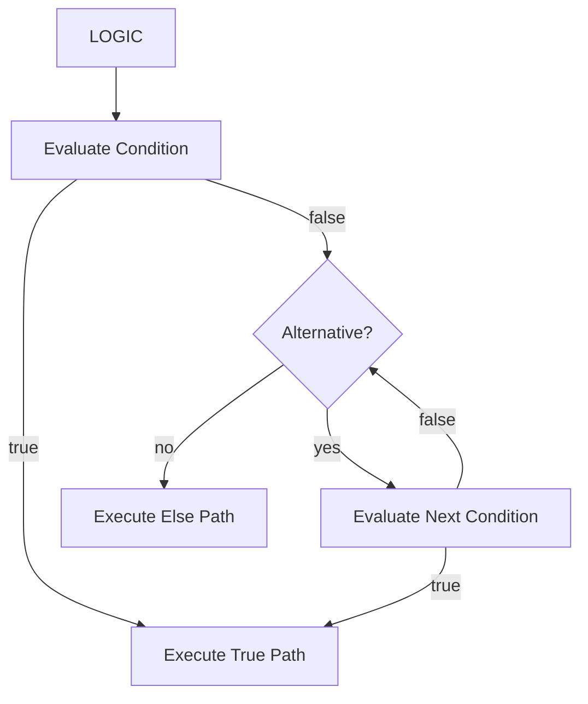
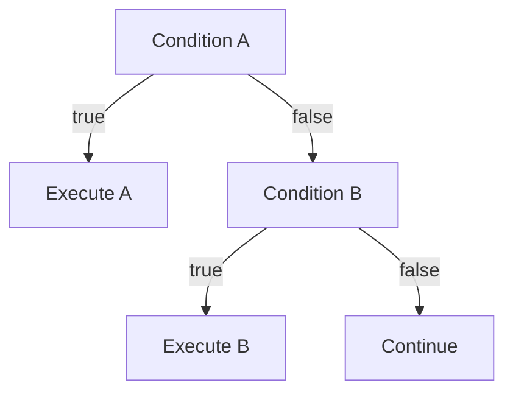

# Chaos Logic

Logic is the primary mechanism Chaos uses to make decisions during execution.

A logic construct evaluates conditions and determines which operations should execute.

## 1. Logic Structure

A logic construct can be understood as:

```text
LOGIC
│
├── CONDITION
│
├── TRUE PATH
│
├── ALTERNATIVE CONDITIONS
│
└── FALLBACK PATH
```

Conceptually:



## 2. Conditions

Conditions are expressions whose result determines execution.

For example:

```chaos
if {health > 0}
    execute continue,
```

The expression is evaluated against the current runtime state.

If the result is true, the associated operation executes.

## 3. If

The `if` construct defines the primary condition:

```chaos
if {x > 10}
    execute operation,
```

The condition is evaluated when the logic construct executes.

## 4. Else If

Multiple conditions can be evaluated sequentially:

```text
if condition A
    operation A

else if condition B
    operation B
```

Only the first matching branch executes.



## 5. Else

An `else` branch provides a fallback when no preceding condition succeeds.

```text
if A
    execute A
else if B
    execute B
else
    execute C
```

Exactly one branch is selected.

## 6. Runtime Evaluation

Conditions are evaluated using the current Runtime State Store.

```text
state:
    health = 75

        │
        ▼

condition:
    {health > 50}

        │
        ▼

      true

        │
        ▼

execute operation
```

Because evaluation occurs at runtime, changes to state can affect subsequent decisions.

## 7. Nested Logic

Logic constructs may contain additional conditional logic.

```text
LOGIC
│
└── IF
    │
    └── LOGIC
        ├── IF
        └── ELSE
```

This allows complex decision structures without requiring the runtime to encode each possible branch explicitly.

## 8. Invalid Conditions

A condition must produce a value that can be interpreted as a logical result.

Invalid conditions produce runtime errors rather than being silently coerced.

Examples include:

```text
Invalid expression
Undefined state
Incompatible operand types
Invalid comparison
```

## 9. Logic and State

Logic does not maintain a separate copy of program state.

Instead:

```text
             Runtime State
                   │
                   ▼
              Evaluate
               condition
                   │
          ┌────────┴────────┐
          ▼                 ▼
        true              false
          │                 │
          ▼                 ▼
      operation        next branch
```

This ensures that decisions always operate on the current runtime state.