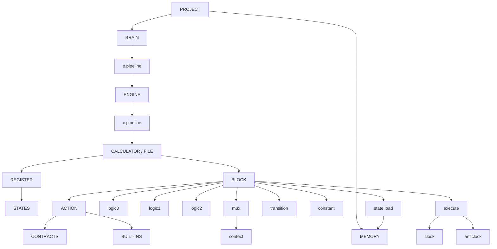

## Working Notes as I build Chaos

this has perhaps grown way out of the original scope, which was to simply build a sort of universal code transpiler that could generate files in proper structure, translate simple words into code in target languages, and reduce the need to manage a backend and a frontend and a database on different sites, etc.

but the more i work on that, the more i find that other things piss me off more than having to log into GitHub with another app's authentication code. such as the syntax of Rust, or C. why??? why must it be this way? surely there is a more efficient way to develop syntax?

to find out the answer to this pressing question, i embarked on a journey to understand how programming languages are made. however, in today's world of AI-generated code and barely any humans offering help (rather choosing to mockyour workflow for not using Claude to write your code), it seems rather difficult to learn pure programming.

god bless the MIT OpenCourseWare lectures. they're from decades ago, and focus on technical aspects purely. no other source has taught me as much about programming that a few lecture notes from 'Computation Structures', of all things.

i'm not saying that people who generate code with AI are useless. in fact, i entirely support the use of AI for code generation alone. i sympathise with you folks - i hate typing out line after line of words and symbols i cannot read together or understand.

but i still want the experience of being a disney channel hacker. just open a terminal and start typign and boom, things come into being. no crying over AWS, not scrolling through reddit hate comments for a simple explanation, no having to fix the bugs made by Claude cause it decided to change my architecture into what it thinks is better in terms of industry standards.

im a student, not an employee. i dont NEED industry standards, i want what i built to run properly and then laugh with joy and the result. 

so, ahem, say hello to chaos. this wi;ll be my document to track my progress of building the chaos language and eventually the CLI for it, because i suck at keeping physical notes (god bless the times i stared at my own handwriting in utter devastation). at least here, the words are legible, even if nonsensical, rambling, or too philosophical at time.

## Friday, August 7, 2026
Chaos has a few words in its vocabulary now, and they're all based on a computer's hardware. this makes it rather confusing for someone who KNOWS about hardware to use this language, cause similar words mean slightly different things, but hey, that's the fun part about languages. it has to confuse you for a bit with synonyms before enlightening you.

the most basic element of chaos is logic. logic0, to be specific. i'll explain in a bit. logic0, logic1, contracts, action, and sometimes mux + context, makes up a block. a block is something like a combinational device. it is a fully operational thing, a gear in a machine. the machine itself is a calculator (because it works like an actual calculator does). it can do operations, compute things, etc., but to make it BETTER than a normal calculator, you can give it a register. this is where it stores data, as states, in case you need to collect data and then use it elsewhere and then change it and store again and so on. 

hopefully i manage to sit down and write a formal document for the language, this is just my brain dump, my apologies to anyone who happens to read this.

if you connect a bunch of calculators together, it creates an engine. yes sort of surprising change of physical objects, but think of what an engine truly is. think of what it DOES, and imagine that. same way you imagine what a calculator does, not the literal flat device with buttons itself.

an engine is a functional app, at this stage. a folder in a normal project could be an engine, and its files, calculators. neat stack of blocks.

and you further connect all your engines together to create the brain, the file.chaos that is your entire software itself. voila. so simple.

now let's look at the basic blocks as of today:
1. logic0 - asks a question and decides the next path.
2. logic1 - creates a loop if needed.
3. logic2 - creates an array if needed.
4. contract - a reusable rule or guarantee provided by Chaos.
5. action - a user-defined combination of contracts to verify.
6. mux - chooses behavior based on the current context.
7. context - the environment or role that determines how something behaves.
8. register - the section where all states are declared before use.
9. state - a named piece of information stored for later use.
10. transition - defines how a state changes over time.
11. metastable - runs Chaos' built-in validation before information becomes trusted.
12. c.pipeline - connects calculators into a single engine.
13. e.pipeline - connects engines into the project's brain.
14. block - the smallest executable unit of logic in Chaos.
15. calculator - a complete Chaos source file made of blocks.
16. engine - a collection of calculators working together.
17. brain - the complete Chaos project formed from all engines.
18. clock - executes in the main execution flow, waiting when necessary.
19. anticlock - executes independently without blocking the current flow.
20. sequence - a reusable custom behavior beyond actions. future idea.
21. decoder - part of sequence. also a future idea.
22. (state) load - calls data directly from the central memory instead of the register.
23. constant - allows you to declare a block-use value so it doesn't have to call the register or memory.

it'll change and evolve and grow over time, for sure. but let this remain here as a small reminder of where i started on this journey.

## Sunday, August 9
think i've decided on the syntax for version one. almost. still missing a few more terms but like, this one works. im sure of it. 

| Syntax       | Purpose                                                                                                                                                                                                     |
| ------------ | ----------------------------------------------------------------------------------------------------------------------------------------------------------------------------------------------------------- |
| `logic0`     | Primitive logic question/decision.                                                                                                                                                                          |
| `logic1`     | Creates a loop/repetition when necessary.                                                                                                                                                                   |
| `logic2`     | Creates temporary cache/retained information, effectively acting as a mini-register for the relevant computation.                                                                                           |
| `mux`        | Replaces `logic0` when an operation requires state/context changes.                                                                                                                                         |
| `context`    | Provides the contextual information associated with each state within a `mux`.                                                                                                                              |
| `action`     | The main operational component of a block. Built from contracts and built-ins.                                                                                                                              |
| `contract`   | A predefined small reusable function/instruction.                                                                                                                                                           |
| `built-in`   | A larger/native reusable operation that can function independently rather than needing to be assembled from smaller contracts.                                                                              |
| `execute`    | Triggers execution of a block.                                                                                                                                                                              |
| `clock`      | Execution follows the established flow/order.                                                                                                                                                               |
| `anticlock`  | Execution proceeds independently of the established flow/order. If no execution mode follows `execute`, `clock` is assumed.                                                                                 |
| `c.pipeline` | Connects calculators/files together into an engine.                                                                                                                                                         |
| `e.pipeline` | Connects engines to the central brain.                                                                                                                                                                      |
| `register`   | Small working storage declared at the top of a calculator.                                                                                                                                                  |
| `state`      | The name/concept for data stored in the register.                                                                                                                                                           |
| `transition` | Defines the rules governing how a state may change in response to inputs/conditions.                                                                                                                        |
| `memory`     | Central project-level storage, essentially a project database for large data such as lists and tables. Accessible by blocks.                                                                                |
| `state load` | Pulls data from central `memory` for use by a block.                                                                                                                                                        |
| `constant`   | Block-level fixed data. A constant can hold a specific declared value, such as `x = 5`, which remains fixed for that block. A constant can also be configured to use the latest value retained by `logic2`. |
| `list`       | Ordered collection with automatically assigned positions beginning at `0`. Essentially Chaos's abstraction of an array.                                                                                     |
| `linkedlist` | Conventional linked list.                                                                                                                                                                                   |
| `stack`      | Collection following `push`/`pop` semantics. LIFO.                                                                                                                                                          |
| `queue`      | Collection following FIFO semantics. Exact Chaos operation words are not yet decided.                                                                                                                       |
| `tree`       | Hierarchical binary-tree storage. Exact operation terminology is not yet decided.                                                                                                                           |
| `branch`     | Enhanced binary-search/decision structure using progressive halving to eliminate possibilities during searches. Exact construction/search terminology is not yet decided.                                   |
| `encode`     | Named mathematical function whose definition contains mathematical syntax.                                                                                                                                  |
| `decode`     | Named mathematical function whose definition contains mathematical syntax.                                                                                                                                  |
| `sequence`   | Mathematical construct for mathematical processes that don't belong inside `encode`/`decode`.                                                                                                               |

now lies before the daunting task of tackling C for actually making this work. damn.

i should've stuck to building a CLI with Rust. oh well.

so a typical chaos project would look something like

obviously i havent included the actual necessities of a project. maybe you're using this for web development and have html and css. or for something else, alongside another language. this is simply what the structure of the CHAOS part looks like. somewhat. 

## Monday, 10th August
today, the first bit of Chaos is being made (or at least i'm attempting to do so). logic0 is a primitive, and conceptually very simple. it asks a question, gets an input, sends that input to whatever little function was declared to do sanitization or verification, and then receives the new output, checks it against its allowed actions, and proceeds to the next step.

C, however, is terrible. goddammit.