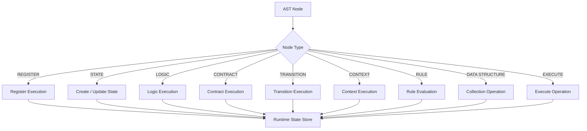

# Chaos Runtime and State System

The Chaos runtime is responsible for turning the structures represented by the AST into live program state.

Its central component is the Runtime State Store.

## 1. Runtime Model

The runtime can be viewed as a state transformation system:

```text
             ┌──────────────────┐
             │      AST         │
             └────────┬─────────┘
                      │
                      ▼
             ┌──────────────────┐
             │     Runtime      │
             └────────┬─────────┘
                      │
              executes operation
                      │
                      ▼
             ┌──────────────────┐
             │ Runtime State    │
             │     Store        │
             └────────┬─────────┘
                      │
                      ▼
              Updated program
                   state
```

The runtime does not modify the AST to represent changing program values.

Instead, the AST describes the program while the Runtime State Store contains its current state.

## 2. Runtime State

Each runtime state contains a name, a value, and a link to the next state:

```text
┌──────────────────────────┐
│ RuntimeState              │
├──────────────────────────┤
│ name                     │
│ value                    │
│ next                     │
└──────────────────────────┘
```

States are stored and retrieved by name.

For example:

```chaos
state: score = 100,
state: player = 'Zia',
```

produces runtime state conceptually equivalent to:

```text
Runtime State Store

score
 └── value: 100

player
 └── value: "Zia"
```

## 3. Runtime Values

A runtime value contains both its type and its underlying data.

```text
RuntimeValue
│
├── NUMBER
├── STRING
├── EXPRESSION
├── LIST
├── QUEUE
├── STACK
└── BRANCH
```

The runtime therefore knows what kind of value it is operating on.

## 4. Runtime Type Safety

The runtime does not blindly trust declarations in the AST.

For example:

```chaos
state: fruits, list = {'apple', 'banana'},
```

declares `fruits` as a list.

When a runtime operation targets `fruits`, the runtime validates that the stored runtime value is actually a list.

```text
              AST
               │
               ▼
        declared: LIST
               │
               │
               ▼
       Runtime State
               │
               ▼
        actual: LIST
               │
          ┌────┴────┐
          │         │
        match    mismatch
          │         │
          ▼         ▼
       execute     error
```

This invariant prevents operations intended for one data structure from accidentally being applied to another.

## 5. State Lookup

Runtime operations frequently need to locate a state by name.

Conceptually:

```text
lookup("fruits")
       │
       ▼
┌───────────────┐
│ State Store   │
├───────────────┤
│ score         │
│ player        │
│ fruits   ◄────┤
│ history       │
└───────────────┘
       │
       ▼
RuntimeState
```

An unknown state is treated as a runtime error rather than silently creating a new value.

## 6. State Mutation

Operations modify runtime state rather than the AST.

For example:

```chaos
list fruits
    (push 'apple'),
```

results in:

```text
Before:

fruits = []


Operation:

push fruits 'apple'


After:

fruits = ['apple']
```

Multiple operations are applied sequentially:

```chaos
list fruits
    (push 'apple')
    (push 'banana')
    (push 'blueberry'),
```

produces:

```text
[]
 │
 ├── push apple
 │      ↓
 │   [apple]
 │
 ├── push banana
 │      ↓
 │   [apple, banana]
 │
 └── push blueberry
        ↓
   [apple, banana, blueberry]
```

## 7. Collection Semantics

Each collection has its own runtime behavior.

```text
              Collection
                  │
        ┌─────────┼─────────┐
        ▼         ▼         ▼
      LIST      QUEUE      STACK
        │         │         │
      ordered     FIFO      LIFO
```

A branch is handled separately because its intended structure is hierarchical rather than linear.

## 8. Queue

A queue removes elements from the front.

```text
push A
push B
push C

┌───┬───┬───┐
│ A │ B │ C │
└───┴───┴───┘
  ↑
 pop
```

Result:

```text
A
```

## 9. Stack

A stack removes elements from the top.

```text
┌───┐
│ C │ ← pop
├───┤
│ B │
├───┤
│ A │
└───┘
```

Result:

```text
C
```

## 10. Runtime Execution

Runtime execution can be represented as a dispatcher:



## 11. Runtime Lifecycle

A Chaos program follows this lifecycle:

```text
┌─────────────┐
│ Source File │
└──────┬──────┘
       ↓
┌─────────────┐
│    Lexer    │
└──────┬──────┘
       ↓
┌─────────────┐
│   Parser    │
└──────┬──────┘
       ↓
┌─────────────┐
│     AST     │
└──────┬──────┘
       ↓
┌─────────────┐
│  Runtime    │
└──────┬──────┘
       ↓
┌─────────────┐
│ State Store │
└──────┬──────┘
       ↓
┌─────────────┐
│ Final State │
└─────────────┘
```

The final state of the program is the result of applying its executable constructs to the runtime state store.

## 12. Runtime Errors

Runtime validation occurs before operations are executed.

Examples of runtime errors include:

```text
Unknown state
Invalid runtime type
Invalid data-structure operation
Empty collection operation
Invalid transition
Invalid contract execution
```

Errors should identify the operation that failed and, where source information is available, its location.

## 13. Runtime Design Principle

The runtime maintains a strict separation between:

```text
WHAT THE PROGRAM IS
        │
        ▼
       AST

WHAT THE PROGRAM CURRENTLY CONTAINS
        │
        ▼
Runtime State Store
```

This separation allows Chaos to evolve its execution model without coupling runtime mutations directly to the parsed representation of the source program.