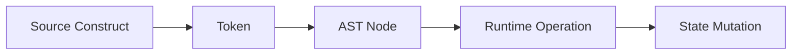

# Chaos Syntax

This document describes the syntax used by Chaos v1.

## 1. Program Structure

Chaos programs are composed of named computational structures.

The principal constructs are:

```text
register
state
logic
constant
transition
context
rule
execute
contract
list
queue
stack
branch
```

A program may combine these constructs to describe state, computation, control flow, and data.

## 2. Basic Values

Chaos supports several fundamental value forms.

### Numbers

```chaos
state: integer = 42,
state: decimal = 3.14159,
```

### Strings

Strings are enclosed in single quotes:

```chaos
state: name = 'Zia',
state: message = 'Hello, Chaos',
```

### Expressions

Expressions are enclosed in `{}`:

```chaos
state: result = {x + 1},
```

The braces distinguish expressions from ordinary literal values.

## 3. States

A state associates a name with a value:

```chaos
state: x = 42,
state: name = 'Chaos',
```

A state may also declare a data structure:

```chaos
state: fruits, list = {'apple', 'banana'},
```

The general form is:

```text
state: <name> [ , <type> ] = <value>,
```

## 4. Registers

Registers organize states into named collections of runtime state.

```chaos
register main
    state: x = 10,
    state: name = 'Zia',
```

A register therefore acts as a named state environment.

## 5. Lists

Lists represent ordered collections.

```chaos
state: fruits, list = {
    'apple',
    'banana',
    'blueberry'
},
```

Operations may be expressed separately:

```chaos
list fruits
    (push 'strawberry')
    (push 'raspberry')
    (pop),
```

The comma terminates the operation group.

## 6. Queues

Queues use FIFO semantics.

```chaos
state: waiting, queue = {
    'first',
    'second',
    'third'
},
```

Operations:

```chaos
queue waiting
    (push 'fourth')
    (pop),
```

The first element inserted is the first element removed.

```text
push → BACK

[first] [second] [third] [fourth]
   ↑
  pop
```

## 7. Stacks

Stacks use LIFO semantics.

```chaos
state: history, stack = {
    'older',
    'old'
},
```

Operations:

```chaos
stack history
    (push 'new')
    (pop),
```

The most recently inserted element is removed first.

```text
        push
         ↓
      [new]
      [old]
    [older]
         ↑
        pop
```

## 8. Branches

Branches represent hierarchical data.

```chaos
state: tree, branch = {
    '50',
    '25',
    '75',
    '10',
    '30'
},
```

The branch type is distinct from lists, queues, and stacks and is intended for tree-oriented operations.

## 9. Data-Structure Operations

Data-structure operations explicitly identify both the structure type and the state being operated on.

```chaos
list fruits
    (push 'apple')
    (push 'banana')
    (pop),
```

The syntax prevents ambiguity between similarly named states.

Supported structures are:

```text
list
queue
stack
branch
```

Supported primitive operations are:

```text
push
pop
```

## 10. Logic

Logic constructs describe conditional computation.

A logical construct may contain expressions and conditional branches:

```chaos
logic
    if {x > 10}
        execute something,
```

The exact operations performed by the logic are determined by the constructs contained within it.

## 11. Constants

Constants provide named immutable values:

```chaos
constant: maximum = 100,
```

Constants can be referenced by other language constructs.

## 12. Transitions

Transitions represent movement between computational states or contexts.

```chaos
transition: next_state,
```

A transition can be associated with conditional or contextual execution.

## 13. Contexts

A context groups rules and state-dependent behavior.

Conceptually:

```text
context
│
├── state
├── rule
├── rule
└── execution
```

Contexts allow a program to organize behavior around a particular computational situation.

## 14. Rules

Rules associate conditions with actions.

Conceptually:

```text
RULE
├── condition
└── execution
```

This allows contextual behavior to be expressed without manually encoding every branch as a separate sequence.

## 15. Contracts

Contracts represent reusable executable operations.

A contract can be invoked through an execute construct:

```text
execute
    contract
```

Contracts provide a mechanism for separating reusable behavior from the state and context in which that behavior is invoked.

## 16. Syntax Pipeline

The relationship between source syntax and execution is:



For example:

```chaos
list fruits
    (push 'apple'),
```

becomes conceptually:

```text
SOURCE
  │
  ▼
DATA STRUCTURE OPERATION
  │
  ├── type: list
  ├── state: fruits
  └── operation: push
          │
          ▼
      RUNTIME PUSH
          │
          ▼
 fruits = [apple]
```

Chaos therefore maintains a direct relationship between its source-level computational concepts and their runtime representations.