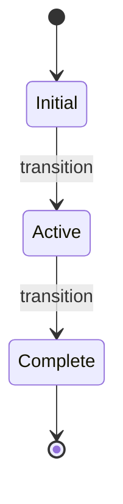
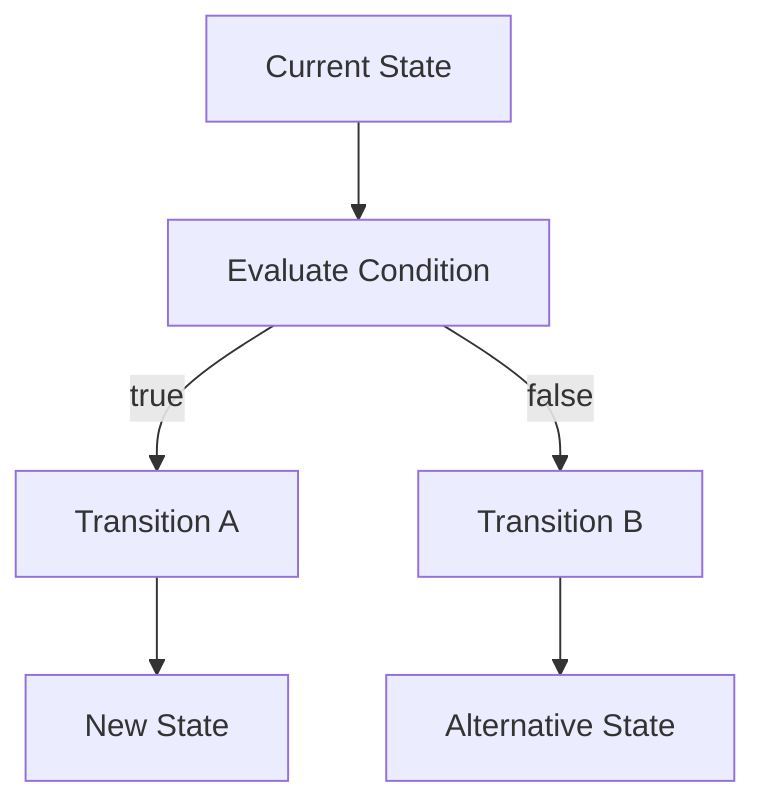

# Chaos Transitions

Transitions control movement between computational states or contexts.

They provide a mechanism for changing which part of a Chaos program is active.

## 1. Transition Model

A transition can be represented as:

```text
SOURCE
  │
  │ transition
  ▼
TARGET
```

The source may be a state or contextual execution environment, depending on the program structure.

## 2. Transition Execution

A transition is evaluated by the runtime and applied to the current execution state.



The runtime validates that the requested target exists before applying the transition.

## 3. Conditional Transitions

Transitions can be combined with logic.

```text
condition
    │
    ├── true  → transition A
    │
    └── false → transition B
```

This allows state-machine-style behavior.



## 4. Transition Validation

Before a transition occurs, the runtime validates its target.

```text
Requested Target
       │
       ▼
Target Exists?
   │         │
  yes        no
   │         │
   ▼         ▼
transition  runtime error
```

Invalid transitions do not silently create new states.

## 5. Transitions and Context

Transitions can be used to move between contexts:

```text
┌──────────────┐
│ Context A    │
└──────┬───────┘
       │
       │ transition
       ▼
┌──────────────┐
│ Context B    │
└──────────────┘
```

This makes contexts suitable for modelling systems whose behavior changes over time.

## 6. Transition Semantics

A transition changes execution state. It does not duplicate or recreate the entire Runtime State Store.

```text
Before:

Context A
State Store
├── x
├── y
└── z

After transition:

Context B
State Store
├── x
├── y
└── z
```

The active computational context changes while persistent runtime state remains available according to the language's state rules.